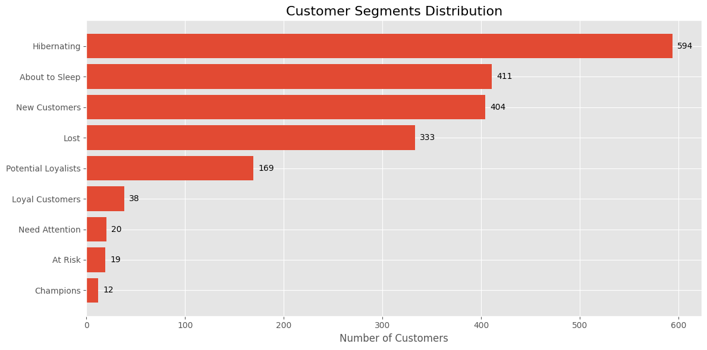
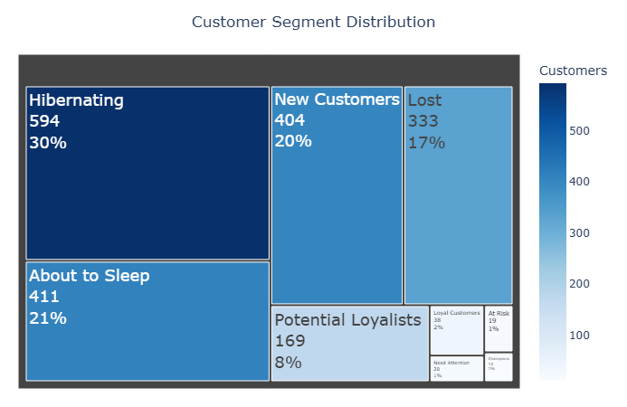
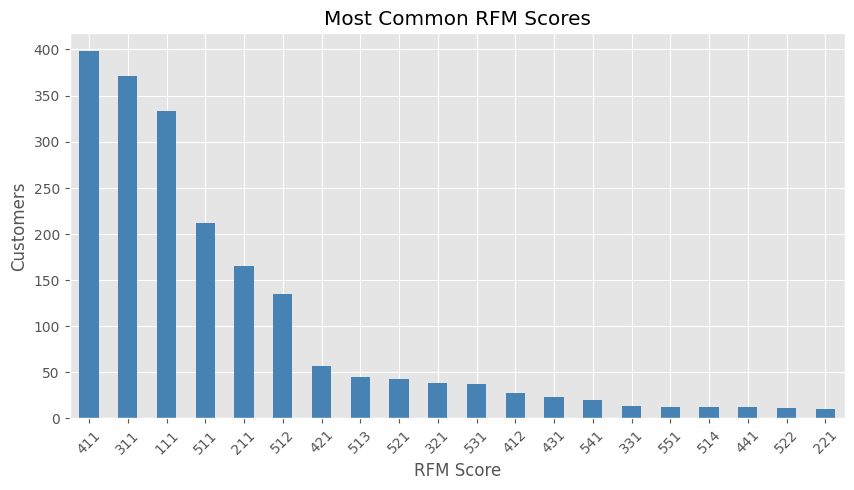
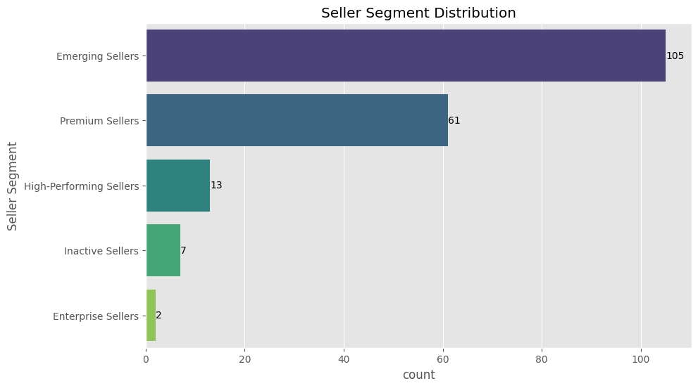

# Customer & Seller Segmentation using Machine Learning

An end-to-end data analytics project demonstrating customer and seller segmentation using business analytics, feature engineering, and unsupervised machine learning.

The repository contains two independent segmentation projects built on real-world e-commerce datasets:

- 📊 Customer Segmentation using **RFM Analysis**
- 🛍️ Seller Segmentation using **K-Means Clustering**

The goal of these projects is to transform raw transactional data into actionable business insights that support customer relationship management and marketplace optimization.

---

# Repository Structure

```
Customer-Seller-Segmentation/
│
├── data/
│
├── notebooks/
│   ├── Customer_RFM_Segmentation.ipynb
│   └── Seller_Segmentation.ipynb
│
├── images/
│   ├── rfm_segments.png
│   ├── rfm_treemap.png
│   ├── seller_clusters.png
│   ├── seller_heatmap.png
│   └── pca_clusters.png
│
└── README.md
```

---

# Project 1 — Customer Segmentation (RFM Analysis)

## Objective

Segment customers according to purchasing behavior using the RFM (Recency, Frequency, Monetary) framework to support targeted marketing campaigns and customer retention strategies.

### Workflow

- Data Cleaning
- Exploratory Data Analysis
- RFM Feature Engineering
- Customer Scoring
- Segment Assignment
- Customer Profiling
- Business Recommendations
- Data Visualization

### Customer Segments

- Champions
- Loyal Customers
- Potential Loyalists
- New Customers
- Promising
- Need Attention
- About to Sleep
- At Risk
- Can't Lose Them
- Hibernating
- Lost

### Example Visualizations





---

# Project 2 — Seller Segmentation

## Objective

Identify different seller profiles in an e-commerce marketplace using feature engineering and K-Means clustering to support marketplace management and seller growth strategies.

### Workflow

- Data Cleaning
- Exploratory Data Analysis
- Seller-Level Feature Engineering
- Data Preprocessing
- Feature Scaling
- Cluster Evaluation
- K-Means Clustering
- Cluster Profiling
- Business Interpretation
- Business Recommendations

### Engineered Features

- Total Products
- Active Product Ratio
- Average Conversion Rate
- Average Product Price
- Average Discount
- Category Diversity
- Premium Product Ratio
- Seller Reliability

### Seller Segments

- Enterprise Sellers
- High-Performing Sellers
- Premium Sellers
- Emerging Sellers
- Inactive Sellers

### Example Visualizations

---

# Tools & Technologies

### Programming

- Python

### Data Analysis

- Pandas
- NumPy

### Visualization

- Matplotlib
- Seaborn
- Plotly

### Machine Learning

- Scikit-learn
- K-Means Clustering
- StandardScaler

### Evaluation Metrics

- Silhouette Score
- Davies–Bouldin Index
- Calinski–Harabasz Index

---

# Business Value

These projects demonstrate how machine learning can be applied to support business decision-making.

### Customer Segmentation

- Personalized marketing campaigns
- Customer retention strategies
- Customer lifetime value optimization
- Churn prevention

### Seller Segmentation

- Seller performance monitoring
- Marketplace optimization
- Seller onboarding strategies
- Seller retention
- Targeted incentive programs

---

# Skills Demonstrated

- Data Cleaning
- Exploratory Data Analysis (EDA)
- Feature Engineering
- Data Visualization
- Customer Analytics
- Marketplace Analytics
- Unsupervised Machine Learning
- K-Means Clustering
- Business Analytics
- Business Storytelling

---

# Future Improvements

- Hierarchical Clustering
- DBSCAN
- Gaussian Mixture Models
- Interactive Dashboard (Plotly / Power BI)
- Automated Segmentation Pipeline
- Model Comparison

---